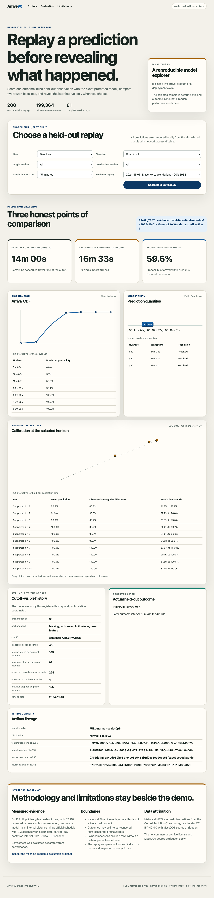

# Arrive90

Arrive90 is a reproducible study of downstream MBTA Blue Line train travel-time distributions from public 2024 vehicle observations.
It turns interval-valued platform observations into censored targets, trains a calibrated XGBoost AFT distribution, evaluates it on a locked chronological holdout, and serves 200 held-out examples through a network-free replay explorer.

The project is a local research artifact, not a live MBTA application.
It predicts time from one observed train position to a selected downstream platform, not waiting time, passenger arrival, or door-to-door travel.



[Watch the recorded local walkthrough](artifacts/demos/replay-explorer-walkthrough.webm).

## Measured result

The immutable final evaluation covers 199,364 destination examples from 36,600 anchors across all 61 service days in November and December 2024.
The promoted `FULL-normal-scale-0p5` bundle achieved interval negative log likelihood of 1.647, compared with 1.673 for the strongest schedule-and-calendar AFT baseline.

On the 157,112 common rows with finite upper bounds, the promoted p50 reduced mean absolute distance to the observed arrival interval by 7.310 seconds versus the official schedule, with a complete-service-day bootstrap 95 percent interval from 6.872 to 7.783 seconds.
It reduced the same diagnostic by 4.874 seconds versus the empirical midpoint baseline, with a 95 percent interval from 4.307 to 5.455 seconds.

| Final-test measure | Promoted result | Evidence boundary |
| --- | ---: | --- |
| Interval negative log likelihood | 1.647 | 199,364 held-out destination examples |
| p50 median absolute interval distance | 5.346 seconds | Finite-upper rows, 95% CI 4.827 to 5.829 |
| Identified 15-minute Brier score | 0.0249 | 152,036 identified rows |
| Mean p90 minus p50 width | 94.057 seconds | All 199,364 resolved predictions |
| December minus November NLL drift | +0.032 | Descriptive temporal comparison |

Every value above maps to the [immutable final report](artifacts/reports/final/travel-time-v1.2.json) with SHA-256 `8bdb9f6e63f284c00b23700096133848d021101dad5134fc34fbf819453ed453`.
The [machine-readable public claim audit](artifacts/reports/qualification/public-claims-v1.2.json) derives every displayed value, denominator, confidence interval, and report pointer from that immutable report.


## Run the portfolio demo

The demo requires Git, Python 3.12, and [uv](https://docs.astral.sh/uv/).
Its committed model and replay fixture are about 1 MiB, so the primary path does not download the 2024 source archive.

```sh
git clone https://github.com/uday1o1/arrive90.git
cd arrive90
uv sync --frozen
make demo
make demo-serve
```

Open `http://127.0.0.1:8000`.
Choose a held-out Blue Line example, request the frozen prediction, inspect its CDF and calibration diagnostics, and then reveal the later interval-valued observation.
The prediction request cannot access the outcome payload.

`make demo` exercises the same scorer without starting a server and verifies the committed terminal manifest byte for byte.

## Verify the repository

Run the Python formatting, lint, strict typing, 90 percent coverage, and deterministic chart gates.

```sh
make check
```

Run the four Chromium user workflows after installing the exact Node and Playwright dependencies.

```sh
make browser-install
make browser-test
```

Run the paired seeded-defect and nearby-control qualification.

```sh
make qualify-milestone6-robustness
```

The complete raw-data reproduction is intentionally separate because it verifies 8.8 GB of acquired bytes and rebuilds the full 2024 pipeline.
See the [reproduction guide](docs/reproduction.md) for that workflow and its already accepted clean-rebuild evidence.

## What is technically owned here

- A public-source acquisition lock over 368 daily Vehicle Position Parquet objects and one official historical schedule database.
- Deterministic normalization of 208,444,419 raw rows with schema evolution, duplicate lineage, conflicting-state quarantine, and bounded memory.
- Exact schedule matching and an episode builder that isolates timestamp gaps and stop-sequence regressions.
- Interval-resolved, left-censored, right-censored, over-width, missing-stop, discontinuity, and no-follow-up outcome states.
- Observation-cutoff features, train-only categorical vocabularies, source-group-safe chronological splits, outcome-blind anchor sampling, and inverse-probability weights.
- Seven immutable AFT and ablation bundles with independent calibration, tamper-evident manifests, and final-test access controls.
- A 2,000-replicate complete-service-day bootstrap evaluation with censoring-aware likelihood, calibration, slice, drift, and point-diagnostic reporting.
- A loopback-only FastAPI explorer whose browser path uses the exact evaluated bundle and an outcome-blind held-out replay fixture.

The model's contribution is incremental and measurable.
The schedule-and-calendar AFT baseline already learns a distribution from schedule context, while the full model adds cutoff-visible vehicle position and prefix-history signals.
Ablations show that removing either signal worsens interval likelihood, but only slightly, so the public claim remains narrower than a claim of broad operational superiority.

## Project map

- [Architecture and data flow](docs/architecture.md)
- [Ingestion and source lineage](docs/ingestion.md)
- [Target semantics](docs/temporal-semantics.md)
- [Methodology](docs/methodology.md)
- [Dataset card](docs/data-card.md)
- [Model card](docs/model-card.md)
- [Evaluation report](docs/evaluation-report.md)
- [Limitations](docs/limitations.md)
- [Reproduction guide](docs/reproduction.md)
- [Replay demonstration](docs/replay-demonstration.md)
- [Source feasibility](docs/source-feasibility.md)
- [Data terms and attribution](DATA_LICENSE.md)
- [Authoritative build plan](BUILD_PLAN.md)

## Attribution and release status

The Vehicle Position archive is provided by the Jacobs Urban Tech Hub at Cornell Tech through Bus Observatory under CC BY-NC 4.0.
The underlying transportation data and historical schedule are attributed to MassDOT and MBTA.
Arrive90 is independent and is not affiliated with or endorsed by Cornell Tech, MassDOT, or MBTA.

The code is available under the [MIT License](LICENSE).
The data-backed portfolio materials are noncommercial, and the repository includes no external deployment, package, release, or publication workflow.
See [DATA_LICENSE.md](DATA_LICENSE.md) for the artifact policy and source links.
