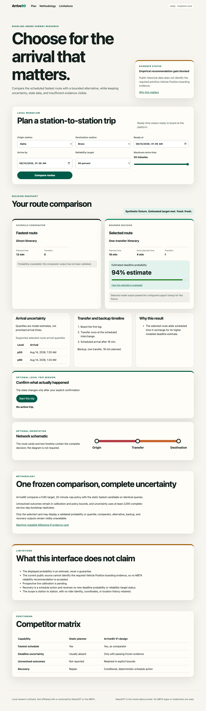

# Arrive90

Arrive90 is a research-grade MBTA subway journey planner built around a strict question: can an itinerary reach a rider-supplied deadline at a supported probability target without unreasonable extra travel time?
The repository implements immutable transit ingestion, point-in-time replay, interval-censored outcomes, deterministic route decisions, a capability-secured API, an accessible browser workflow, synthetic qualifications, and fail-closed evidence gates.

The current answer is intentionally incomplete.
The audited public historical rail export coalesces Vehicle Position and Trip Update stop timestamps without preserving their source identity, so Milestone 0 is `FAILED` and no MBTA arrival probability, calibration, or reliability-improvement claim is accepted.
The default application therefore shows schedule-only guidance and explicit insufficient-evidence states.



The screenshot is a synthetic interface fixture.
It demonstrates the real API, authorization, trip state, event stream, and recovery workflow, but it is not historical or live MBTA performance evidence.

## What is implemented

- Immutable schedule, realtime, alert, and historical archive contracts with explicit event, observation, pipeline, and product-availability timestamps.
- Deterministic zero-transfer and one-transfer candidate contracts with a pinned OpenTripPlanner graph-build path and an independent audit enumerator.
- Virtual-rider interval outcomes, censoring bounds, leakage guards, baseline mechanics, XGBoost AFT mechanics, calibration, output-support discovery, and immutable model bundles.
- Deterministic initial and recovery decisions that suppress unsupported model outputs and never rescore the initial arrival CDF after trip start.
- A FastAPI service with single-use decision capabilities, per-trip bearer authorization, bounded SQLite state, authenticated SSE, restrictive browser headers, safe fallback behavior, backup, and restore.
- An accessible no-map browser flow covering direct, transfer, stale, abstained, unsupported-target, future-ready, trip-state, and recovery states.
- Frozen offline and prospective evaluation protocols with block-bootstrap uncertainty, complete-population denominators, immutable lineage, and seeded negative controls.

See the [architecture](docs/architecture.md), [evaluation report](docs/evaluation-report.md), and [limitations](docs/limitations.md) for the evidence boundary behind each item.

## Run the loopback application

The primary local path requires Python 3.12 and uv 0.11.23.

```sh
uv python install
uv sync --frozen
uv run arrive90-api --host 127.0.0.1 --port 8000
```

Open `http://127.0.0.1:8000`.
The executable rejects non-loopback hosts, exposes no accepted probability bundle, and does not permit trip start while the source gate is blocked.

The API workflow and request contract are documented in [docs/service-api.md](docs/service-api.md).

## Verify the repository

Run formatting, linting, strict typing, the Python suite, and the 90 percent coverage gate.

```sh
make check
```

Run the real Chromium workflows with Node.js 24.16.0 and the exact Playwright lock.

```sh
make browser-install
make browser-test
```

Run the pinned repository and release-image security gate with Docker.

```sh
make security-scan
make security-evidence
```

The scan retains only the compact qualification artifact in Git.
Raw scanner databases, reports, image archives, runtime state, source feeds, models, and profiler output remain ignored.

Run any milestone gate with:

```sh
make gate MILESTONE=0
```

The command exits nonzero for `FAILED` and `INSUFFICIENT_EVIDENCE` reports.
This is expected for the current evidence state and must not be rewritten as a pass.

For a fresh environment, follow [docs/reproduction.md](docs/reproduction.md).

## Evidence snapshot

| Evidence | Observed result | Boundary |
| --- | --- | --- |
| Source feasibility | Milestone 0 `FAILED` | Public rail stop timestamps lack independently identifiable Vehicle Position boarding evidence. |
| Python quality suite | 234 tests passed with 91.20 percent coverage | Local software verification only. |
| Browser qualification | 4 Chromium workflows passed | Synthetic interface workflow only. |
| Fault and recovery qualification | 36 targeted tests passed | Local seeded failures and controls only. |
| Security qualification | 0 critical or high vulnerabilities, misconfigurations, or secrets | Trivy 0.73.0 against the repository and exact local release image. |
| Warm cached schedule search | 7.095403 ms p95 | Synthetic bounded workload on 4 ARM64 CPUs and 8,307,167,232 cgroup bytes. |
| Prospective protocol control | 3,096 scheduled synthetic queries recorded | Protocol mechanics only, with no prospective calibration claim. |

Exact workloads, environment identifiers, hashes, and limitations are in [docs/evaluation-report.md](docs/evaluation-report.md).
No row in this table is evidence that Arrive90 improves real MBTA rider outcomes.

## Resume the empirical build

The next required input is an authorized archive of primitive Vehicle Position observations with stable trip, vehicle, platform, status, observation-time, and product-availability lineage.
Vehicle Position stop observations must remain separately identifiable from Trip Update predictions.

After that source is available, rerun the Milestone 0 audit using the procedure in [docs/source-feasibility.md](docs/source-feasibility.md), then proceed through the frozen downstream gates in order.
The 28-service-day shakeout and fixed 56-service-day shadow panel begin only after the historical bundle is accepted.

## Documentation

- [Architecture](docs/architecture.md)
- [Data card](docs/data-card.md)
- [Model card](docs/model-card.md)
- [Evaluation report](docs/evaluation-report.md)
- [Operations and recovery](docs/operations.md)
- [Security and release boundary](docs/security.md)
- [Reproduction guide](docs/reproduction.md)
- [Limitations](docs/limitations.md)
- [Transit data attribution and terms](DATA_LICENSE.md)
- [Authoritative build plan](BUILD_PLAN.md)

## Attribution and release status

MassDOT provides the transportation data used by Arrive90.
Arrive90 is independent and is not affiliated with or endorsed by MassDOT or MBTA, and it does not use their logos as project branding.
See [DATA_LICENSE.md](DATA_LICENSE.md) for the reviewed terms, source digest, attribution, and redistribution matrix.

The code is available under the [MIT License](LICENSE).
No public deployment, release, package publication, model publication, or external artifact upload is authorized by this repository state.
