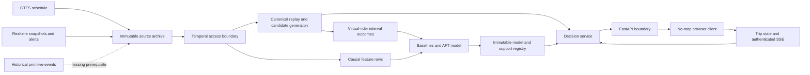

# Architecture

## System boundary

Arrive90 is a station-to-station subway research system.
It accepts an origin station, destination station, ready-to-board time, deadline, reliability target, and maximum extra travel time.
It does not perform door-to-door routing, bus or commuter-rail planning, fare optimization, native notifications, or personal accessibility guarantees.

The currently executable service is loopback-only and schedule-only because the primary historical source gate has failed.
The learned path exists as tested software mechanics but cannot be activated without an accepted immutable model, calibration, support, and decision bundle.

## Data and decision flow

The dotted source edge is the controlling blocker.
The public historical rail export cannot distinguish a Vehicle Position stop observation from a Trip Update arrival prediction after those fields are coalesced.
Without that distinction, the virtual-rider outcome and downstream empirical model path remain closed.

## Packages

| Package | Responsibility |
| --- | --- |
| `arrive90_data_contracts` | Canonical schedule, realtime, candidate, and gate contracts. |
| `arrive90_ingestion` | Immutable archives, collectors, completeness, alert revisions, storage, and temporal views. |
| `arrive90_routing` | Query populations, deterministic candidates, schedule simulation, graph builds, audit enumeration, and recall. |
| `arrive90_features` | Versioned causal feature registry and point-in-time feature construction. |
| `arrive90_outcomes` | Virtual-rider resolution, interval-censored labels, bounds, and baselines. |
| `arrive90_models` | AFT distributions, calibration, support discovery, transfer models, and immutable bundle registry. |
| `arrive90_decision` | Initial itinerary selection, explanation codes, and deterministic recovery. |
| `arrive90_service` | API, authorization, bounded persistence, middleware, fallback behavior, backup, and browser assets. |
| `arrive90_evaluation` | Frozen protocols, uncertainty, prediction and policy metrics, promotion, and prospective panels. |

Imports preserve the causal direction.
Feature code does not import outcome code, and the corresponding architecture test fails if that boundary is crossed.

## Time model

Every usable primitive distinguishes the time an event describes from the time the product could have known it.
The ordering and correction rules are defined in [temporal-semantics.md](temporal-semantics.md).
Queries capture one server-owned cutoff, and all candidates, features, feeds, alerts, support decisions, and model outputs bind to that cutoff.

After trip start, Arrive90 never recomputes the initial arrival CDF with observations outside its temporal support.
State-conditioned recovery is a deterministic schedule action with null deadline probability and null arrival quantiles.

## Persistence and authorization

The local service uses SQLite for single-use decision capabilities, trip snapshots, optimistic state versions, idempotency records, recovery decisions, and the SSE outbox.
Decision capabilities and trip bearers contain 256 bits of randomness and are persisted only as versioned keyed HMAC digests.
The state row and event outbox update in one transaction.

Trip state expires within six hours.
The schema intentionally stores no rider identity or coordinates.
Station and itinerary details needed for an active trip remain sensitive and are excluded from audit logs and error bodies.

## Runtime topology

The default CLI binds to `127.0.0.1` and rejects a non-loopback host.
The release-candidate image runs as UID and GID `65532:65532`, keeps application source read-only, and reserves `/state/arrive90.sqlite3` as its mutable path.
Its default command still binds to loopback.

An intended non-loopback topology would place an authenticated TLS reverse proxy in front of the API and configure exact Host, HTTPS Origin, and trusted proxy IP allow-lists.
That topology is documented for threat analysis only and is not authorized while Milestone 9 is not accepted.

## Evidence namespaces

Historical replay, prospective shadow evaluation, synthetic protocol qualification, browser demonstration, and performance measurement use separate evidence kinds.
No artifact may be relabeled across those namespaces.
The current statuses and immutable artifact links are listed in [evaluation-report.md](evaluation-report.md).
