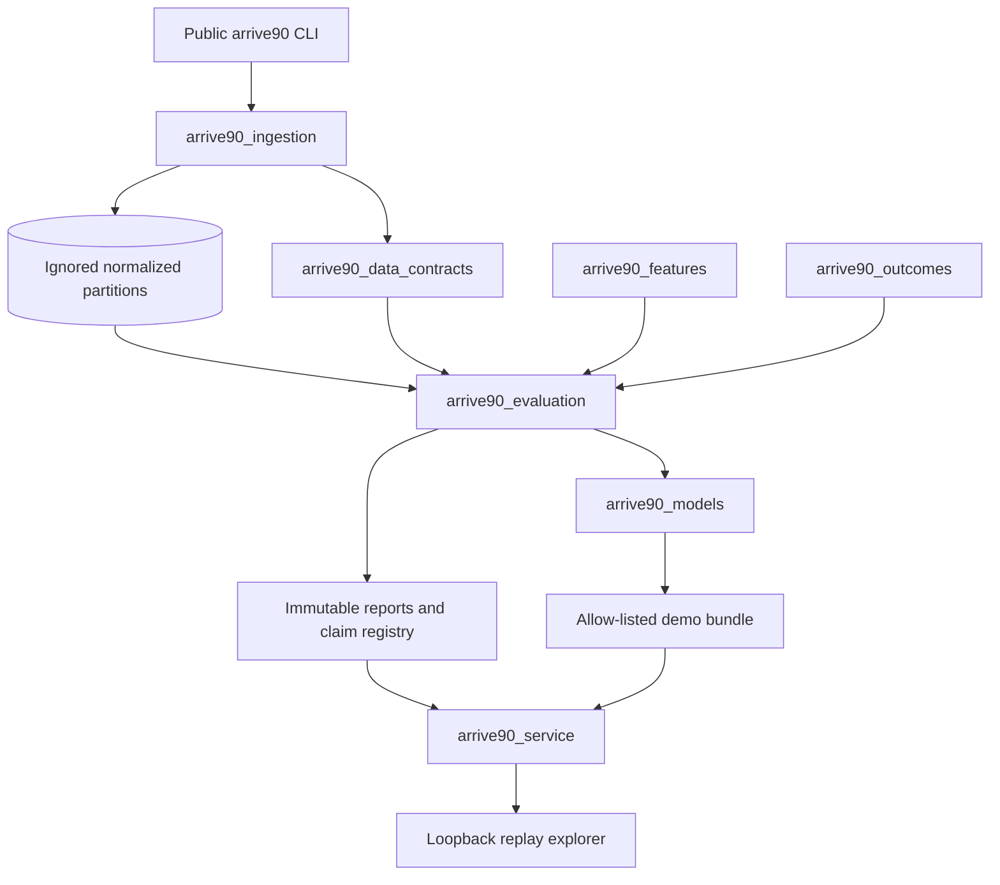

# Architecture

## System boundary

Arrive90 is a local research pipeline and replay explorer for downstream Blue Line train travel-time distributions.
Its input is a historical train observation cutoff, an exact matched trip, and a downstream scheduled platform.
Its output is one calibrated travel-time distribution with p50, p80, p90, and fixed-horizon probabilities.

The system does not model platform waiting, individual passenger events, access or egress walking, multi-line trips, fares, or operational dispatch.
The browser is a held-out evidence explorer rather than an online prediction service.

## Component architecture

| Package | Responsibility |
| --- | --- |
| `arrive90_data_contracts` | Acceptance versions, dataset boundaries, source identities, target states, and fail-closed milestone reports. |
| `arrive90_ingestion` | Inventory locking, resumable verified downloads, schema profiles, schedule extraction, normalization, deterministic episode construction, and immutable manifests. |
| `arrive90_features` | Frozen feature registry, observation-cutoff construction, train-only categorical vocabulary, and CSR transformation. |
| `arrive90_outcomes` | Downstream interval targets and schedule or empirical baselines. |
| `arrive90_models` | AFT distributions, calibrators, XGBoost wrapper, predictive bundle, and immutable registry validation. |
| `arrive90_evaluation` | Population construction, model selection, final-test controls, metrics, bootstrap uncertainty, reports, and replay packaging. |
| `arrive90_service` | Read-only repository validation, real bundle scoring, evidence endpoints, and the browser client. |

Feature construction does not import the outcome package.
The controlled join happens inside evaluation after both partitions are independently manifested.

## Data flow

```mermaid
flowchart LR
    A[Public Bus Observatory inventory] --> B[368 content-verified Parquet objects]
    C[Official 2024 GTFS archive] --> D[Verified read-only SQLite schedule]
    B --> E[Schema-aware normalization]
    D --> E
    E --> F[Canonical observations and quarantines]
    F --> G[Deterministic trip episodes]
    D --> G
    G --> H[Unsampled downstream candidates]
    H --> I[Feature partitions at anchor cutoff]
    H --> J[Later interval-valued outcomes]
    I --> K[Outcome-blind sampled population]
    J --> K
    K --> L[Chronological train, validation, calibration, final splits]
    L --> M[Seven frozen AFT and ablation bundles]
    M --> N[Single frozen final evaluation]
    N --> O[Final report and claim registry]
    N --> P[Sanitized 200-row replay fixture]
    P --> Q[Network-free explorer]
    O --> Q
```

All bulk source and derived data remains ignored.
Only locks, compact reports, the promoted allow-listed bundle, and the sanitized replay fixture are committed.

## Immutable boundaries

The acquisition lock binds the public inventory identity to acquired size, ETag, SHA-256, row count, and schema fingerprint.
The normalization manifest binds source objects to deterministic date and line partitions plus quarantine output.
The model-population manifest binds split boundaries, feature schema, selected anchors, inclusion probabilities, and analysis weights.
The model registry binds source, dataset, split, feature order, dependency lock, model bytes, and calibrator bytes.
The final protocol binds model bundles, horizons, slices, metrics, bootstrap seed, and claims before final-test outcomes are opened.

Each boundary rejects changed bytes instead of accepting a mutable `latest` artifact.

## Runtime path

The FastAPI process loads the committed model and fixture only after every allow-listed hash verifies.
Prediction requests receive cutoff-visible features and never receive outcome bounds or outcome state.
The outcome reveal endpoint reads the separately stored later observation only after a prediction has been displayed.

The CLI accepts only loopback hosts.
The service performs no external network request and stores no user state.
An unsupported line, missing bundle, corrupt model, unknown replay, or unavailable artifact produces a specific fail-closed response.

## Evidence path

Milestone reports under `artifacts/reports/gates` contain the acceptance state and hashes for their complete input evidence.
The public claim registry points back into the immutable final report.
The repository audit verifies that the README values, charts, documentation links, tracked source, ignored data policy, attribution, and clean-checkout evidence remain coherent.
