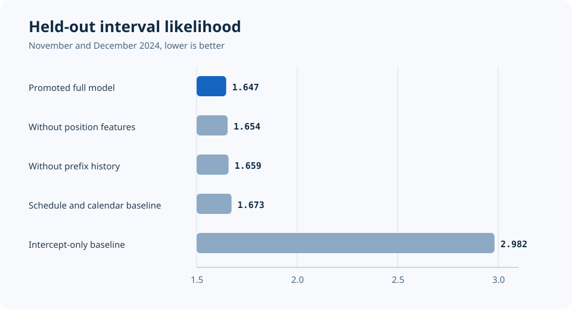
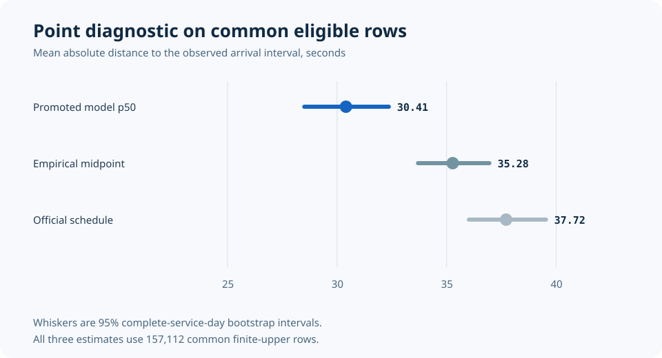

# Evaluation report

## Evidence boundary

The immutable evaluation artifact is [travel-time-v1.2.json](../artifacts/reports/final/travel-time-v1.2.json) with SHA-256 `8bdb9f6e63f284c00b23700096133848d021101dad5134fc34fbf819453ed453`.
It evaluates only downstream Blue Line train time on the frozen November and December 2024 split.
The values below do not measure platform waiting, passenger outcomes, live feed latency, or deployment behavior.

The final test contains 199,364 selected destination examples, 36,600 distinct anchors, and all 61 service days.
Exactly 155,962 rows contribute to interval likelihood, while every selected row remains in availability and outcome-mass reporting.

## Distributional comparison

| Frozen bundle | Role | Interval NLL |
| --- | --- | ---: |
| `FULL-normal-scale-0p5` | Promoted full model | 1.6470 |
| `NO_POSITION_OBSERVATION-normal` | Ablation | 1.6541 |
| `NO_PREFIX_HISTORY-normal` | Ablation | 1.6588 |
| `SCHEDULE_CALENDAR-normal` | Strongest comparable AFT baseline | 1.6735 |
| `INTERCEPT_ONLY-normal` | Intercept-only baseline | 2.9816 |
| `FULL-extreme-scale-1p0` | Alternative full distribution | 37.3954 |
| `FULL-logistic-scale-1p0` | Alternative full distribution | 341.6238 |

The promoted NLL bootstrap interval is 1.6069 to 1.6865 using complete service-day blocks.
The final protocol retains the poor alternative distributions instead of hiding them after test access.

## Point diagnostics

Point diagnostics use the 157,112 common rows with finite upper bounds and exclude 42,252 censored or unavailable rows.
They are narrower than the primary interval-likelihood comparison.

| Point estimate | Mean absolute interval distance | 95% bootstrap interval |
| --- | ---: | --- |
| Promoted model p50 | 30.405 seconds | 28.505 to 32.359 |
| Empirical midpoint | 35.279 seconds | 33.694 to 36.949 |
| Official schedule | 37.715 seconds | 36.018 to 39.535 |

The paired promoted-minus-schedule difference is -7.310 seconds with a 95 percent interval from -7.783 to -6.872.
The paired promoted-minus-empirical difference is -4.874 seconds with a 95 percent interval from -5.455 to -4.307.
Negative values favor the promoted model.

## Calibration and horizon metrics

| Horizon | Identified Brier score | Expected calibration error | Supported |
| --- | ---: | ---: | --- |
| 5 minutes | 0.02671 | 0.00762 | Yes |
| 10 minutes | 0.02670 | 0.02574 | Yes |
| 15 minutes | 0.02487 | 0.00916 | Yes |
| 20 minutes | 0.00515 | 0.00247 | Yes |
| 30 minutes | 0.00025 | 0.00018 | Yes |
| 45 minutes | 0.00001 | 0.00001 | Yes |
| 60 minutes | approximately 0 | approximately 0 | Yes |

The fixed-horizon report also publishes complete-population lower and upper Brier bounds that retain unresolved outcomes.
Low error at long horizons mostly reflects near-certain completion within the long time window and should not be read as difficult long-range forecasting skill.

## Quantiles and uncertainty

The promoted p50 has median absolute interval distance 5.346 seconds, with a bootstrap interval from 4.827 to 5.829.
Its mean p90 minus p50 width is 94.057 seconds and its 95th percentile width is 223.727 seconds.
The p90 empirical coverage is partially identified between 0.814 and 0.928 because some outcomes remain interval censored.

All uncertainty estimates use exactly 2,000 complete-service-day bootstrap replicates with seed 902024 and linear quantiles.
No individual destination row is resampled independently of its service day.

## Slice and drift evidence

The final report contains every predeclared slice for line direction, peak period, day type, month, season, destination class, scheduled remaining bucket, observation gap, schedule deviation, platform match, stop-sequence match, trip match, and outcome class.
Every slice includes raw rows, analysis weight, distinct anchors, and distinct service days.

The highest anchor schedule-deviation bucket has interval NLL 1.853, compared with the overall 1.647, making it a visible weakness rather than an omitted subgroup.
December NLL is 1.663 versus 1.630 in November, a descriptive increase of 0.032.
The mean predicted 15-minute probability changed by only 0.00088 between the two months.

## Retained outcome mass

| Outcome state | Raw rows | Analysis weight |
| --- | ---: | ---: |
| Interval resolved | 148,297 | 126,287.30 |
| Left censored | 7,154 | 9,717.92 |
| Missing stop observation | 40,499 | 28,735.32 |
| No follow-up | 247 | 155.68 |
| Over-width interval | 1,661 | 1,742.58 |
| Right censored | 511 | 421.50 |
| Session discontinuity | 995 | 631.70 |

Schedule-unmatched rows have zero mass in the selected Blue final population because exact schedule matching is a preselection requirement.

## Robustness and performance

Nine paired defect and control scenarios cover interrupted resume, partial objects, changed ETags, schema drift, malformed Parquet, duplicate conflicts, low disk, corrupt model bytes, and missing explorer artifacts.
All nine pairs pass for their intended reason and preserve the final-report, replay-fixture, and terminal-manifest hashes.

| Stage | Frozen workload | p95 | Peak RSS |
| --- | --- | ---: | ---: |
| Acquisition verification | 368 vehicle objects plus schedule lock | 5.269 s | 269,516,800 bytes |
| One-object normalization | 377,143 source rows | 1.518 s | 371,113,984 bytes |
| Episode construction | 25,717 normalized observations | 84.5 ms | 371,113,984 bytes |
| Full-year dataset generation | 1,151,892 selected rows | 648.1 s | 1,145,915,806 bytes |
| Seven-bundle training and calibration | 507,976 training rows | 113.0 s | 1,145,915,806 bytes |
| Batch scoring | 200 held-out replays | 922.0 ms | 371,113,984 bytes |
| API scoring | One warm replay | 5.17 ms | 371,113,984 bytes |
| Explorer startup | Cold verification and model load | 58.1 ms | 371,113,984 bytes |

The full-year normalizer peaked at 634,109,952 bytes while reading an 8,804,061,429-byte raw store.
Performance and correctness evidence are separate, and no optimization was performed because no measured acceptance bottleneck required one.

## Reproducibility

The clean full-year qualification rebuilt normalization, episode and dataset generation, training, and final report reconstruction from the immutable raw lock.
The first pass matched the committed terminal manifest.
The second pass verified all derived stages as no-ops and did not change the size or nanosecond modification time of any of 4,827 derived files.

See [reproduction.md](reproduction.md) for commands and exact prerequisites.
