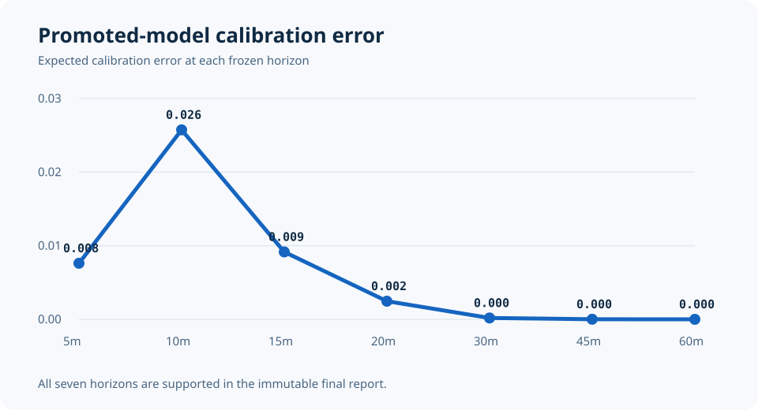

# Model card

## Model summary

The promoted model is `FULL-normal-scale-0p5`, a calibrated XGBoost accelerated failure-time distribution for downstream Blue Line train travel time.
It was selected on August and September validation data, calibrated on October, and evaluated once on November and December 2024.

| Property | Frozen value |
| --- | --- |
| Objective | `survival:aft` |
| Error distribution | Normal |
| AFT scale | 0.5 |
| Boosting rounds | 48 |
| Maximum depth | 3 |
| Learning rate | 0.08 |
| Training threads | 1 |
| Training seed | 90 |
| Feature columns | 88 |
| Learned parameters | 678 |
| Serialized promoted bundle | 67,213 bytes |
| Bundle manifest SHA-256 | `1c49f5702cfd7bbd6ad4633a59fd71c42333c28cb53c390ccbf8c07a0ab6e06b` |

## Intended use

The bundle supports reproducible research and the local held-out replay explorer.
It estimates a distribution over elapsed time from a historical train observation cutoff to a selected downstream Blue Line platform.

It is not intended for live rider guidance, passenger-specific guarantees, dispatch, safety decisions, or service outside the frozen Blue Line scope.

## Inputs

The model consumes exact matched route, direction, origin, destination, route pattern, stop sequences, scheduled remaining time, schedule progress, local calendar features, observed origin lateness, elapsed episode time, cutoff-visible prefix history, observation gap, and current position fields with explicit missingness indicators.

Every schedule input must have been published by the observation cutoff.
Every vehicle input must have an event timestamp at or before the cutoff and belong to the same isolated episode fragment.
Outcome state, duration bounds, future observations, final episode length, and post-outcome aggregates are forbidden.

## Outputs

The calibrated bundle exposes one monotone cumulative distribution.
The explorer reads fixed-horizon probabilities at 5, 10, 15, 20, 30, 45, and 60 minutes and quantiles at p50, p80, and p90.
A quantile that cannot be reached within the frozen 210-minute search horizon remains explicitly unresolved.

The mean p90 minus p50 width on the final test is 94.057 seconds, with a 95th percentile of 223.727 seconds.

## Evaluation

| Measure | Final-test result |
| --- | ---: |
| Interval negative log likelihood | 1.6470 |
| NLL 95% bootstrap interval | 1.6069 to 1.6865 |
| Identified 15-minute Brier score | 0.02487 |
| p50 median absolute interval distance | 5.346 seconds |
| p50 median-distance 95% interval | 4.827 to 5.829 seconds |
| p90 empirical coverage bounds | 0.814 to 0.928 |

The strongest comparable AFT baseline, `SCHEDULE_CALENDAR-normal`, recorded interval NLL 1.6735.
Removing position observations increased NLL to 1.6541, and removing prefix history increased it to 1.6588.
These are small held-out differences, so the accepted claim is an incremental improvement within the frozen study rather than general superiority.

## Calibration

Each compared bundle has a separately fitted monotone sigmoid calibrator using only October data.
The promoted bundle's expected calibration error is 0.0076 at 5 minutes, 0.0257 at 10 minutes, 0.0092 at 15 minutes, and 0.0025 at 20 minutes.
All seven frozen horizons are supported, but longer horizons are nearly saturated and are not evidence of difficult long-range discrimination.

## Limitations and prohibited uses

Vehicle observations define interval-valued train-presence evidence rather than exact passenger arrivals.
The compacted archive does not preserve historical fetch time or feed-header time, so the model excludes features that require exact historical product availability.

The source year is 2024, the modeled line is Blue, and the final test contains only November and December.
Unmeasured distribution shift, rare disruptions, different schedule eras, or operational feed behavior may invalidate performance.

Do not use the model for accessibility guarantees, safety-critical decisions, employment, policing, fares, dispatch control, or claims about individual people.
Do not extend it to other routes or time periods without a new frozen data audit and untouched evaluation interval.
