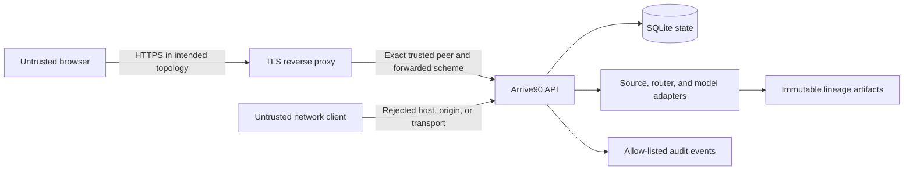

# Security and release boundary

## Status

The implemented local boundary has passing authorization, resource-limit, redaction, retention, fault, backup, restore, static, dependency, secret, configuration, and container qualifications.
The repository and exact release-candidate image had zero critical or high findings in the retained Trivy 0.73.0 qualification.

These results do not authorize non-loopback deployment.
Milestone 9 depends on every prior acceptance gate, and the source gate is currently `FAILED`.
The CLI and image therefore remain loopback-only.

## Assets

- Single-use decision capabilities that authorize one exact recommendation.
- Per-trip bearer secrets that authorize reads, mutations, stops, and event streams.
- HMAC key material and bounded key-version rings.
- Immutable decision, candidate, feature, model, support, feed, and alert lineage.
- Explicit rider-confirmed trip state and state-conditioned recovery authority.
- SQLite trip state and SSE outbox consistency.
- Service availability under bounded request, rate, stream, event, and storage resources.

The service stores no rider identity or coordinates.
Station, time, itinerary, state, alert, capability, and bearer values are treated as sensitive observability data.

## Trust boundaries

In local mode, the browser connects directly to loopback over HTTP and HSTS is still returned as part of the frozen response contract.
In the intended shared topology, only the exact proxy may supply authoritative forwarded scheme or client address values.
The backend listener must not be reachable from an untrusted network.

## Threats and controls

| Threat | Implemented control | Verification |
| --- | --- | --- |
| Capability replay or trip takeover | 256-bit secrets, versioned HMAC digests, constant-time comparison, exact binding, atomic single use, and per-trip bearer checks. | Concurrent store and public API tests. |
| Cross-site state change | Exact Origin validation on search, creation, mutation, and stop with no wildcard CORS. | Host, Origin, and authorization tests. |
| Forwarded-header spoofing | Forwarded values accepted only from an exact trusted proxy IP and only as one valid value. | Trusted and untrusted forwarding fixtures. |
| Resource exhaustion | Frozen maxima for bodies, rates, key cardinality, event count, event bytes, event age, stream count, state lifetime, and cleanup interval. | Boundary, concurrent limiter, and configuration rejection tests. |
| Sensitive logging | Route-template, method, status, and reason allow-list with no request body, station, time, itinerary, identifier, capability, bearer, alert, or event payload. | Audit redaction and sink-failure tests. |
| Browser script injection | No third-party runtime scripts, JSON serialization, inert text rendering, restrictive CSP, no framing, no referrer, no MIME sniffing, and minimal permissions. | Browser and header tests. |
| Partial state or event writes | One SQLite transaction for state, idempotency, and outbox changes. | Injected atomicity and SSE failure tests. |
| Dependency or image compromise | Exact lockfiles and image digests, non-root runtime, read-only smoke test, Trivy dependency, secret, license, configuration, and image scans, and Ruff security rules. | `milestone-9-security.json`. |
| Backup tampering or data retention | Create-only mode `0600` backup, digest and schema manifest, integrity checks, expiry purge, and no-overwrite restore. | Backup, restore, tamper, and CLI tests. |
| Dependency outage or clock regression | Named source and model fallback, router and database 503 behavior, stream-slot recovery, and wall-clock fail-closed guard. | `milestone-9-reliability.json`. |

## HTTP security contract

Non-loopback configuration requires HTTPS, exact Host values, exact HTTPS Origin values, and exact trusted proxy IPs.
Wildcard hosts and origins are invalid.
Plaintext non-loopback requests fail before route or model work.

Responses use `Cache-Control: no-store`, a restrictive content security policy, HSTS, `Referrer-Policy: no-referrer`, `X-Content-Type-Options: nosniff`, frame denial, and a minimal permissions policy.
The browser keeps capabilities and bearers in memory only and uses authenticated fetch streaming because `EventSource` cannot attach the bearer header.

## Key operations

Production-shaped configuration accepts at most two decision keys and two trip keys, each at least 256 bits.
The active key version signs new digests.
An old decision key may remain only for the ten-minute capability window.
An old trip key may remain only for the six-hour session window.

Keys must be injected through a protected secret mechanism and must never be committed, printed, placed in command history, embedded in an image, or included in a backup manifest.

## Scan evidence

The retained compact report is [milestone-9-security.json](../artifacts/reports/qualification/milestone-9-security.json).
It binds the exact Trivy image digest, database timestamps, raw report hashes, release-image ID, runtime user, finding counts, and static-analysis output.
Raw scanner output and databases are ignored because they are mutable and large.

The locked dependency and attribution inventory is [licenses-v1.json](../artifacts/reports/qualification/licenses-v1.json).
The fault and recovery report is [milestone-9-reliability.json](../artifacts/reports/qualification/milestone-9-reliability.json).

## Residual risk

Operating-system compromise, malicious browser extensions, denial of service beyond the bounded local workload, upstream package compromise without a published advisory, hardware faults, and operator mishandling of runtime secrets remain possible.
The project has no independent penetration test, external security review, managed key service integration, public load test, or public deployment observation.

The public historical source remains unsuitable for the primary empirical claim.
That is an evidence-integrity risk rather than a network vulnerability, and the service mitigates it by abstaining.

## Release decision

Every critical or high finding discovered during implementation was resolved rather than ignored.
PyArrow was upgraded from the affected 21.0.0 release to 25.0.0, benchmark images received non-root users, and the release and benchmark bases moved from a Debian image with unfixed findings to an exact Alpine image with none at the qualifying scan time.

Publication, deployment, package release, model upload, and external artifact publication still require explicit user authorization.
No such action has been taken.

The earlier local threat model remains at [threat-model-milestone-5.md](threat-model-milestone-5.md) for design history.
This document is the Milestone 9 intended-topology update.
